# Gym Social — Entity Relationship Diagram (ERD)

**Version:** 1.0  
**Database:** PostgreSQL recommended

---

## 1. ERD Purpose

This document defines the persistence model for Gym Social.

It answers:

- What data exists?
- What is the owner of each record?
- How do records relate?
- Which records are public vs private?
- Which data should be normalized?
- Which constraints are required?

The ERD is intentionally separate from product requirements and technical implementation.

---

# 2. High-Level Domain Model

```text
USER
├── PROFILE
├── SETTINGS
├── SOCIAL GRAPH
│   ├── FOLLOW
│   ├── FOLLOW REQUEST
│   ├── BLOCK
│   └── MUTE
│
├── FITNESS
│   ├── WORKOUT
│   │   ├── WORKOUT EXERCISE
│   │   │   └── WORKOUT SET
│   │
│   ├── TEMPLATES
│   ├── PROGRAMS
│   ├── GOALS
│   └── PERSONAL RECORDS
│
├── SOCIAL ACTIVITIES
│   ├── ACTIVITY
│   ├── PHOTOS
│   ├── HASHTAGS
│   ├── LIKES
│   ├── COMMENTS
│   ├── BOOKMARKS
│   └── MENTIONS
│
├── NUTRITION
│   ├── CALORIE CALCULATIONS
│   ├── CALORIE GOALS
│   ├── FOODS
│   ├── MEALS
│   ├── NUTRITION ENTRIES
│   └── FOOD SCANS
│
└── PROGRESS
    ├── WEIGHT
    ├── BODY MEASUREMENTS
    └── PROGRESS PHOTOS
```

---

# 3. Mermaid ER Diagram

```mermaid
erDiagram

    USERS ||--|| PROFILES : has
    USERS ||--|| USER_SETTINGS : has

    USERS ||--o{ FOLLOWS : follows
    USERS ||--o{ FOLLOWS : followed_by
    USERS ||--o{ FOLLOW_REQUESTS : requests
    USERS ||--o{ BLOCKS : blocks
    USERS ||--o{ MUTES : mutes

    USERS ||--o{ WORKOUTS : owns
    WORKOUTS ||--o{ WORKOUT_EXERCISES : contains
    EXERCISES ||--o{ WORKOUT_EXERCISES : used_in
    WORKOUT_EXERCISES ||--o{ WORKOUT_SETS : contains

    USERS ||--o{ WORKOUT_TEMPLATES : owns
    WORKOUT_TEMPLATES ||--o{ WORKOUT_TEMPLATE_EXERCISES : contains
    EXERCISES ||--o{ WORKOUT_TEMPLATE_EXERCISES : template_item

    USERS ||--o{ PROGRAMS : owns
    PROGRAMS ||--o{ PROGRAM_WEEKS : contains
    PROGRAM_WEEKS ||--o{ PROGRAM_DAYS : contains
    PROGRAM_DAYS ||--o{ PROGRAM_EXERCISES : contains
    EXERCISES ||--o{ PROGRAM_EXERCISES : planned
    PROGRAMS ||--o{ PROGRAM_ASSIGNMENTS : assigned
    USERS ||--o{ PROGRAM_ASSIGNMENTS : receives

    USERS ||--o{ FITNESS_GOALS : has
    USERS ||--o{ PERSONAL_RECORDS : achieves
    EXERCISES ||--o{ PERSONAL_RECORDS : relates_to
    WORKOUTS ||--o{ PERSONAL_RECORDS : achieved_in

    WORKOUTS ||--o| ACTIVITIES : published_as
    USERS ||--o{ ACTIVITIES : publishes
    ACTIVITIES ||--o{ ACTIVITY_PHOTOS : contains
    ACTIVITIES ||--o{ ACTIVITY_HASHTAGS : tagged
    HASHTAGS ||--o{ ACTIVITY_HASHTAGS : used_by
    ACTIVITIES ||--o{ LIKES : receives
    USERS ||--o{ LIKES : creates
    ACTIVITIES ||--o{ COMMENTS : contains
    USERS ||--o{ COMMENTS : writes
    COMMENTS ||--o{ COMMENTS : replies_to
    USERS ||--o{ BOOKMARKS : creates
    ACTIVITIES ||--o{ BOOKMARKS : saved
    ACTIVITIES ||--o{ MENTIONS : contains
    USERS ||--o{ MENTIONS : mentioned

    USERS ||--o{ CALORIE_CALCULATIONS : calculates
    USERS ||--o{ CALORIE_GOALS : sets
    USERS ||--o{ MEALS : creates
    MEALS ||--o{ NUTRITION_ENTRIES : contains
    USERS ||--o{ NUTRITION_ENTRIES : logs
    FOOD_ITEMS ||--o{ NUTRITION_ENTRIES : referenced_by

    USERS ||--o{ FOOD_SCANS : uploads
    FOOD_SCANS ||--o{ FOOD_SCAN_ITEMS : contains
    FOOD_ITEMS ||--o{ FOOD_SCAN_ITEMS : matched_to

    USERS ||--o{ WEIGHT_RECORDS : records
    USERS ||--o{ BODY_MEASUREMENTS : records
    USERS ||--o{ PROGRESS_PHOTOS : uploads

    USERS ||--o{ NOTIFICATIONS : receives
    USERS ||--o{ REPORTS : submits
    USERS ||--o{ AUDIT_LOGS : creates
```



---

# 4. users

Primary identity record.

| Column | Type | Notes |
|---|---|---|
| id | UUID | PK |
| email | varchar | Unique |
| username | varchar | Unique |
| password_hash | text | Never plaintext |
| display_name | varchar | Required |
| avatar_url | text | Nullable |
| status | varchar | active/suspended/deleted |
| email_verified_at | timestamp | Nullable |
| created_at | timestamp | Required |
| updated_at | timestamp | Required |

Indexes:

- unique(email)
- unique(username)
- status
- created_at

---

# 5. profiles

| Column | Type | Notes |
|---|---|---|
| user_id | UUID | PK/FK users |
| date_of_birth | date | Nullable |
| sex | varchar | Nullable |
| height_cm | numeric | Nullable |
| activity_level | varchar | Nullable |
| training_experience | varchar | Nullable |
| fitness_goal | varchar | Nullable |
| bio | text | Nullable |
| created_at | timestamp | Required |
| updated_at | timestamp | Required |

---

# 6. user_settings

| Column | Type |
|---|---|
| user_id | UUID PK |
| locale | varchar |
| timezone | varchar |
| unit_system | varchar |
| default_activity_visibility | varchar |
| nutrition_visibility | varchar |
| weight_visibility | varchar |
| measurement_visibility | varchar |
| notification_settings | jsonb |
| privacy_settings | jsonb |
| created_at | timestamp |
| updated_at | timestamp |

---

# 7. follows

| Column | Type | Notes |
|---|---|---|
| follower_id | UUID | FK users |
| followed_id | UUID | FK users |
| created_at | timestamp | |

Composite PK:

`(follower_id, followed_id)`

Constraint:

`follower_id != followed_id`

---

# 8. follow_requests

| Column | Type |
|---|---|
| id | UUID PK |
| requester_id | UUID FK users |
| target_id | UUID FK users |
| status | varchar |
| created_at | timestamp |
| updated_at | timestamp |

Unique pending request per pair.

---

# 9. blocks

| Column | Type |
|---|---|
| blocker_id | UUID FK users |
| blocked_id | UUID FK users |
| created_at | timestamp |

Composite PK:

`(blocker_id, blocked_id)`

---

# 10. mutes

| Column | Type |
|---|---|
| user_id | UUID FK users |
| muted_user_id | UUID FK users |
| created_at | timestamp |

---

# 11. exercises

Global and custom exercises.

| Column | Type |
|---|---|
| id | UUID PK |
| owner_user_id | UUID nullable |
| name | varchar |
| description | text |
| instructions | text |
| primary_muscle_group | varchar |
| secondary_muscles | jsonb |
| equipment | varchar |
| exercise_type | varchar |
| tracking_mode | varchar |
| difficulty | varchar |
| media_url | text nullable |
| is_global | boolean |
| active | boolean |
| created_at | timestamp |
| updated_at | timestamp |

Business rule:

- `is_global = true` means normal users cannot modify it.

---

# 12. workouts

| Column | Type |
|---|---|
| id | UUID PK |
| user_id | UUID FK users |
| template_id | UUID nullable |
| program_day_id | UUID nullable |
| title | varchar |
| status | varchar |
| started_at | timestamp |
| completed_at | timestamp nullable |
| duration_seconds | integer nullable |
| notes | text |
| created_at | timestamp |
| updated_at | timestamp |

---

# 13. workout_exercises

| Column | Type |
|---|---|
| id | UUID PK |
| workout_id | UUID FK |
| exercise_id | UUID FK |
| order_index | integer |
| notes | text |
| created_at | timestamp |

Unique:

`(workout_id, order_index)`

---

# 14. workout_sets

| Column | Type |
|---|---|
| id | UUID PK |
| workout_exercise_id | UUID FK |
| set_number | integer |
| set_type | varchar |
| weight | numeric nullable |
| reps | integer nullable |
| duration_seconds | integer nullable |
| distance | numeric nullable |
| rpe | numeric nullable |
| rir | numeric nullable |
| completed | boolean |
| notes | text |
| created_at | timestamp |
| updated_at | timestamp |

---

# 15. workout_templates

| Column | Type |
|---|---|
| id | UUID PK |
| user_id | UUID FK |
| name | varchar |
| description | text |
| active | boolean |
| created_at | timestamp |
| updated_at | timestamp |

---

# 16. workout_template_exercises

| Column | Type |
|---|---|
| id | UUID PK |
| template_id | UUID FK |
| exercise_id | UUID FK |
| order_index | integer |
| target_sets | integer nullable |
| target_reps | varchar nullable |
| target_weight | numeric nullable |
| rest_seconds | integer nullable |
| notes | text |

---

# 17. programs

| Column | Type |
|---|---|
| id | UUID PK |
| user_id | UUID FK |
| name | varchar |
| description | text |
| active | boolean |
| created_at | timestamp |
| updated_at | timestamp |

---

# 18. program_weeks

| Column | Type |
|---|---|
| id | UUID PK |
| program_id | UUID FK |
| week_number | integer |
| name | varchar nullable |

Unique:

`(program_id, week_number)`

---

# 19. program_days

| Column | Type |
|---|---|
| id | UUID PK |
| program_week_id | UUID FK |
| day_number | integer |
| name | varchar |
| notes | text |

---

# 20. program_exercises

| Column | Type |
|---|---|
| id | UUID PK |
| program_day_id | UUID FK |
| exercise_id | UUID FK |
| order_index | integer |
| target_sets | integer |
| target_reps | varchar |
| target_weight | numeric nullable |
| notes | text |

---

# 21. program_assignments

| Column | Type |
|---|---|
| id | UUID PK |
| program_id | UUID FK |
| user_id | UUID FK |
| start_date | date |
| end_date | date nullable |
| status | varchar |

---

# 22. fitness_goals

| Column | Type |
|---|---|
| id | UUID PK |
| user_id | UUID FK |
| name | varchar |
| goal_type | varchar |
| target_value | numeric nullable |
| target_unit | varchar nullable |
| start_value | numeric nullable |
| start_date | date |
| target_date | date nullable |
| status | varchar |
| notes | text |
| created_at | timestamp |
| updated_at | timestamp |

---

# 23. personal_records

| Column | Type |
|---|---|
| id | UUID PK |
| user_id | UUID FK |
| exercise_id | UUID nullable |
| workout_id | UUID nullable |
| record_type | varchar |
| value | numeric |
| unit | varchar |
| achieved_at | timestamp |

Indexes:

- `(user_id, exercise_id, record_type)`
- `achieved_at`

---

# 24. activities

A published social representation of a workout.

| Column | Type |
|---|---|
| id | UUID PK |
| user_id | UUID FK |
| workout_id | UUID UNIQUE FK |
| title | varchar |
| description | text |
| activity_type | varchar |
| visibility | varchar |
| started_at | timestamp |
| ended_at | timestamp |
| duration_seconds | integer |
| volume | numeric nullable |
| calories_burned_estimate | numeric nullable |
| location_id | UUID nullable |
| published_at | timestamp |
| created_at | timestamp |
| updated_at | timestamp |

Important:

One workout may publish to at most one activity.

A workout may have no activity.

---

# 25. activity_photos

| Column | Type |
|---|---|
| id | UUID PK |
| activity_id | UUID FK |
| storage_key | text |
| thumbnail_key | text |
| sort_order | integer |
| width | integer |
| height | integer |
| created_at | timestamp |

---

# 26. hashtags

| Column | Type |
|---|---|
| id | UUID PK |
| tag | varchar UNIQUE |
| created_at | timestamp |

Store normalized lowercase value.

---

# 27. activity_hashtags

| Column | Type |
|---|---|
| activity_id | UUID FK |
| hashtag_id | UUID FK |

Composite PK:

`(activity_id, hashtag_id)`

---

# 28. likes

| Column | Type |
|---|---|
| user_id | UUID FK |
| activity_id | UUID FK |
| created_at | timestamp |

Composite PK:

`(user_id, activity_id)`

---

# 29. comments

| Column | Type |
|---|---|
| id | UUID PK |
| activity_id | UUID FK |
| user_id | UUID FK |
| parent_comment_id | UUID nullable |
| text | text |
| created_at | timestamp |
| updated_at | timestamp |
| deleted_at | timestamp nullable |

Self-reference allows threaded replies.

---

# 30. bookmarks

| Column | Type |
|---|---|
| user_id | UUID FK |
| activity_id | UUID FK |
| created_at | timestamp |

Composite PK:

`(user_id, activity_id)`

---

# 31. mentions

| Column | Type |
|---|---|
| id | UUID PK |
| activity_id | UUID FK |
| user_id | UUID FK |
| context_type | varchar |
| context_id | UUID nullable |
| created_at | timestamp |

---

# 32. calorie_calculations

Stores historical calculator results.

| Column | Type |
|---|---|
| id | UUID PK |
| user_id | UUID FK |
| formula | varchar |
| age | integer |
| sex | varchar |
| height_cm | numeric |
| weight_kg | numeric |
| activity_level | varchar |
| bmr | numeric |
| tdee | numeric |
| goal | varchar |
| adjustment | numeric |
| target_calories | numeric |
| created_at | timestamp |

---

# 33. calorie_goals

Current or historical calorie targets.

| Column | Type |
|---|---|
| id | UUID PK |
| user_id | UUID FK |
| calorie_target | numeric |
| protein_target_g | numeric |
| carbs_target_g | numeric |
| fat_target_g | numeric |
| fiber_target_g | numeric nullable |
| start_date | date |
| end_date | date nullable |
| source | varchar |
| active | boolean |
| created_at | timestamp |

---

# 34. food_items

Global and personal food catalog.

| Column | Type |
|---|---|
| id | UUID PK |
| owner_user_id | UUID nullable |
| name | varchar |
| brand | varchar nullable |
| serving_size | numeric |
| serving_unit | varchar |
| calories | numeric |
| protein_g | numeric |
| carbs_g | numeric |
| fat_g | numeric |
| fiber_g | numeric nullable |
| barcode | varchar nullable |
| source | varchar |
| verified | boolean |
| is_global | boolean |
| created_at | timestamp |
| updated_at | timestamp |

---

# 35. meals

| Column | Type |
|---|---|
| id | UUID PK |
| user_id | UUID FK |
| name | varchar |
| consumed_at | timestamp |
| notes | text |
| created_at | timestamp |
| updated_at | timestamp |

---

# 36. nutrition_entries

| Column | Type |
|---|---|
| id | UUID PK |
| user_id | UUID FK |
| meal_id | UUID nullable |
| food_item_id | UUID nullable |
| source | varchar |
| food_name | varchar |
| quantity | numeric |
| unit | varchar |
| calories | numeric |
| protein_g | numeric |
| carbs_g | numeric |
| fat_g | numeric |
| fiber_g | numeric nullable |
| consumed_at | timestamp |
| confidence_score | numeric nullable |
| notes | text |
| created_at | timestamp |
| updated_at | timestamp |

---

# 37. food_scans

| Column | Type |
|---|---|
| id | UUID PK |
| user_id | UUID FK |
| storage_key | text |
| status | varchar |
| provider | varchar |
| model | varchar |
| created_at | timestamp |
| completed_at | timestamp nullable |
| error_code | varchar nullable |

---

# 38. food_scan_items

| Column | Type |
|---|---|
| id | UUID PK |
| food_scan_id | UUID FK |
| recognized_name | varchar |
| matched_food_id | UUID nullable |
| estimated_quantity | numeric nullable |
| estimated_unit | varchar nullable |
| calories | numeric nullable |
| protein_g | numeric nullable |
| carbs_g | numeric nullable |
| fat_g | numeric nullable |
| fiber_g | numeric nullable |
| confidence | numeric nullable |
| user_confirmed | boolean |
| created_at | timestamp |
| updated_at | timestamp |

---

# 39. weight_records

| Column | Type |
|---|---|
| id | UUID PK |
| user_id | UUID FK |
| weight | numeric |
| unit | varchar |
| recorded_at | timestamp |
| source | varchar |
| notes | text |

---

# 40. body_measurements

| Column | Type |
|---|---|
| id | UUID PK |
| user_id | UUID FK |
| measurement_type | varchar |
| value | numeric |
| unit | varchar |
| recorded_at | timestamp |
| notes | text |

---

# 41. progress_photos

| Column | Type |
|---|---|
| id | UUID PK |
| user_id | UUID FK |
| photo_type | varchar |
| storage_key | text |
| recorded_at | timestamp |
| notes | text |

These should be treated as private records by default.

---

# 42. notifications

| Column | Type |
|---|---|
| id | UUID PK |
| user_id | UUID FK |
| type | varchar |
| title | varchar |
| message | text |
| payload | jsonb |
| read_at | timestamp nullable |
| created_at | timestamp |

Index:

`(user_id, created_at desc)`

---

# 43. reports

| Column | Type |
|---|---|
| id | UUID PK |
| reporter_user_id | UUID FK |
| target_type | varchar |
| target_id | UUID |
| reason | varchar |
| details | text |
| status | varchar |
| created_at | timestamp |
| resolved_at | timestamp nullable |

---

# 44. moderation_actions

| Column | Type |
|---|---|
| id | UUID PK |
| moderator_user_id | UUID FK |
| report_id | UUID nullable |
| target_type | varchar |
| target_id | UUID |
| action | varchar |
| reason | text |
| created_at | timestamp |

---

# 45. audit_logs

| Column | Type |
|---|---|
| id | UUID PK |
| user_id | UUID nullable |
| action | varchar |
| entity_type | varchar |
| entity_id | UUID nullable |
| metadata | jsonb |
| created_at | timestamp |

Do not store passwords or tokens.

---

# 46. Key Constraints

Required:

- Unique username
- Unique email
- No self-follow
- No duplicate follow
- No duplicate like
- No duplicate bookmark
- One activity per workout
- Workout set belongs to a workout owned by the same user
- Nutrition entry belongs to a user
- Food scan belongs to a user
- Private content requires owner/permission access

---

# 47. Ownership Chain

Private data must have an unambiguous ownership chain.

Example:

```text
WorkoutSet
  ↓
WorkoutExercise
  ↓
Workout
  ↓
User
```

and:

```text
Activity
  ↓
User
```

Authorization should resolve the complete ownership chain server-side.

---

# 48. Recommended Indexes

### Social

- follows.followed_id
- follows.follower_id
- activities.user_id + published_at
- activities.visibility + published_at
- likes.activity_id
- comments.activity_id + created_at

### Workout

- workouts.user_id + started_at
- workout_exercises.workout_id
- workout_sets.workout_exercise_id
- personal_records.user_id + achieved_at

### Nutrition

- nutrition_entries.user_id + consumed_at
- meals.user_id + consumed_at
- food_items.name
- food_items.barcode

### Progress

- weight_records.user_id + recorded_at
- body_measurements.user_id + recorded_at
- progress_photos.user_id + recorded_at

---

# 49. Retention / Deletion

Application-level deletion must distinguish:

- Social activity
- Underlying workout
- Nutrition
- Media
- Account

Deletion behavior should be explicit rather than cascading blindly.

---

# 50. ERD Design Principle

The database represents the user's fitness history and social graph.

The most important relationship is:

```text
USER
   ↓
WORKOUT
   ↓
WORKOUT SETS
   ↓
ACTIVITY
   ↓
SOCIAL INTERACTIONS
```

Nutrition is a parallel domain linked to the same user:

```text
USER
   ↓
NUTRITION
   ↓
FOOD
   ↓
FOOD SCAN / AI
```

This structure keeps the social activity model and nutrition model independent while allowing both to power the same athlete profile.
